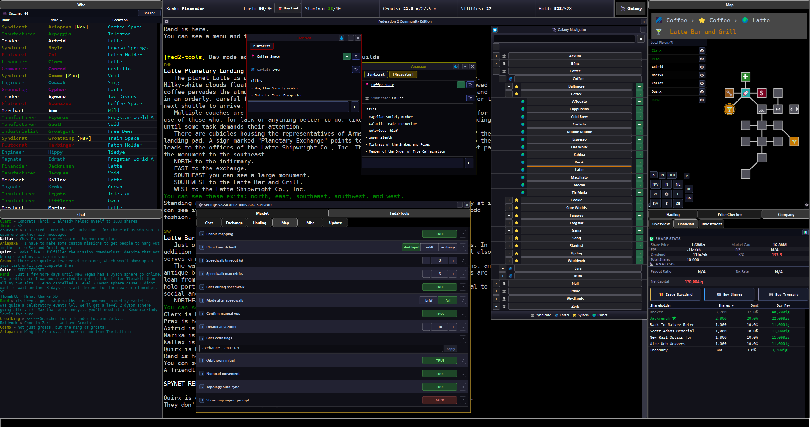

# fed2-tools

A Mudlet package for [Federation 2 Community Edition](https://federation2.com) — mapping, navigation, automated trading, factory management, planet-owner tools, and quality-of-life automation, with an optional [Muxlet](https://github.com/tmtocloud/Muxlet)-based GUI.

Version 2 is a full rewrite of the original fed2-tools. If you're upgrading from a 1.x install, expect commands and settings to have moved; see [Getting Started](#getting-started) below.

## Installation

Install however suits you:

- **In Mudlet:** run `mpkg install fed2-tools` in your Federation 2 profile — Mudlet fetches the latest release directly from the [Mudlet Package Repository](https://github.com/Mudlet/mudlet-package-repository).
- **Manual:** download the latest `fed2-tools.mpackage` from [Releases](../../releases), then in Mudlet open **Package Manager** and install it into your Federation 2 profile.

fed2-tools installs [Muxlet](https://github.com/tmtocloud/Muxlet) automatically the first time it loads — Muxlet powers the optional GUI panels below, no separate step needed. Everything else (mapping, hauling, factory tools, etc.) works without it.

### Choosing a startup mode

On first load fed2-tools asks how you'd like Muxlet to start. Pick whichever fits how you play — you're not locked in, and every command/alias works the same regardless of mode:

- **Full (recommended)** — loads the ready-made fed2-tools workspace (output pane and map side by side, plus the panels below) automatically every session. Some panels appear only when they're relevant to you: the Company tab only shows at Industrialist rank and above, its Investment sub-tab only at Financier, and the Exchange pane swaps itself to Futures Market depending on your rank and room — all driven by Muxlet's condition/rule engine, no manual toggling needed.
- **Build Your Own Workspace (BYOW)** — Muxlet starts on a blank canvas with every fed2-tools panel registered and ready to drop into any pane or tab from its **Content Library**. Same building blocks as Full, but you lay them out yourself — and if you want the same rank- or room-based show/hide behavior Full gets for free, you can wire it up with your own Muxlet condition rules.
- **Minimal** — no changes to your Mudlet layout at all. Run `mux start` any time later (then `mux workspace load fed2-tools` for the full layout) if you change your mind.

### Staying up to date

fed2-tools checks for new production releases on startup by default and offers to install them — this applies regardless of which startup mode you picked above. Pre-release/dev builds are never offered unless you opt in. Both are configurable under **Fed2-Tools › Update** in Settings, along with a "Check for updates now" button.

## Getting Started

Run `f2t` for a full command overview, or `f2t status` to see which components are enabled. Every component also takes its own `help`, e.g. `map help`, `haul help`, `factory help`.

## Features

**Mapping & Navigation** (`map`, `nav`)
Automatic room-by-room mapping as you move, syndicate/cartel/system galaxy topology tracking, saved destinations, speedwalk navigation by name/hash/room ID, planet and system exploration (single room, planet, system, cartel, syndicate, or full galaxy), manual room/exit editing, special exits (arrival commands, circuit travel like trains and shuttles), and map import/export.

**Automated Trading** (`haul`)
Rank-aware automated commodity trading: analyzes exchange prices, buys low, sells high, and repeats across a queue of profitable commodities. Supports Exchange mode and rank-gated modes (Armstrong Cuthbert, Akaturi merchant runs), with configurable profit margins and pause behavior.

**Factory Management** (`factory`, `fac`)
Status table for all your factories, one-command flush-to-market, and settings for automatic pre-reset flushing.

**Planet Owner Tools** (`po`)
Exchange economy breakdowns for your planets, filterable by commodity group.

**Commodities** (`bb`, `bs`, `price`)
Bulk buy/sell at the exchange and cross-cartel price analysis to find the best deals.

**Stamina & Refueling**
Automatic stamina monitoring with food-run automation (or a yes/no prompt in standalone use), and GMCP-driven automatic ship refueling with an emergency out-of-fuel trigger.

**Death Protection**
Tracks your last safe room and halts other automation (hauling, exploration) on death so you don't wake up mid-cycle.

**Chat History** (`f2t chat`)
Persistent, searchable com/tell/say history that survives reconnects.

## Muxlet GUI Panels

With Muxlet installed, fed2-tools adds these panels to the Content Library:

- **Galaxy Navigator** — browse every syndicate, cartel, system, and planet; click to travel
- **Fed2 Map** — the live Mudlet mapper
- **Company** — overview, factories, financials, and portfolio (Financier+) as separate panes
- **Exchange** — live prices (or futures for Traders/Financiers) with a ticker
- **Futures Market** — contracts on offer and your open positions, with profit scoring
- **Price Checker** — cartel price scanning for the best profit
- **Commodities** — reference table of names, codes, and base prices
- **Cargo** — live ship manifest
- **Hauling Jobs** — Armstrong Cuthbert job board with route distance and effective pay
- **Player Info** — rank, fuel, stamina, groats, slithies, and hold at a glance
- **Chat** — com/say/tell history with filters and timestamps
- **Who** / **Local Players** — online and in-room player lists

## Acknowledgments

- **Colborn (ping65510)** — original creator of fed2-tools.
- **Swift ([Ohmi02/Fed2](https://github.com/Ohmi02/Fed2/))** — original idea for the multi-window UI layout (exchange/stats/mapper/chat split panes), later merged into fed2-tools.
- **tmtocloud (jackrungh)** — took over maintenance from Colborn, merged in Swift's UI layout, and has since rewritten most of the codebase.
